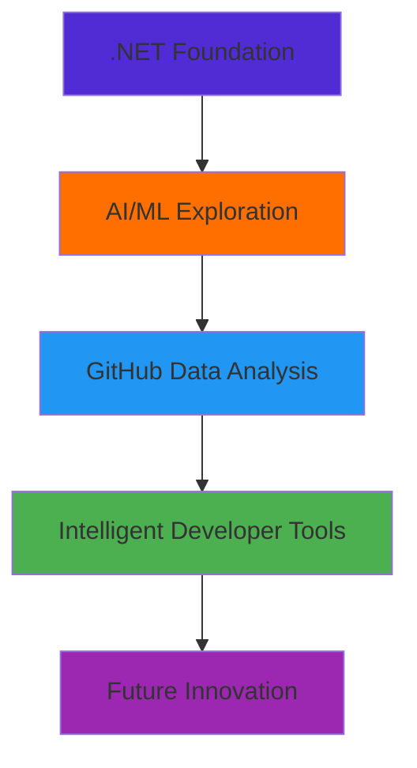

# 👋 Hello! I'm  Mhon

<div align="center">
  
</div>

## 🧑‍💻 About Me

I'm **pcbimon**, a passionate programmer who started my journey with **.NET** and has always been fascinated by exploring new technologies. Currently, I'm diving deep into **AI and Data Analysis**, with a particular focus on applying AI to analyze GitHub data to gain deeper insights into software development patterns and behaviors.

```csharp
public class Developer
{
    public string Name { get; set; } = "pcbimon";
    public List<string> Skills { get; set; } = new() { ".NET", "C#", "AI/ML", "Data Analysis" };
    public string CurrentFocus { get; set; } = "AI for GitHub Data Analytics";
    public bool AlwaysLearning { get; set; } = true;
}
```

## 🚀 Current Journey

🔬 **Currently Learning:** AI systems for GitHub data analysis  
🎯 **Goal:** Building tools that help developers better understand codebases and development patterns  
💡 **Interests:** Machine Learning, Natural Language Processing, Software Engineering Analytics

## 🛠️ Tech Stack

### 💼 Professional Experience


### 🤖 AI & Data Science (Learning)


### 🔧 Tools & Platforms


## 📊 GitHub Analytics

<div align="center">
  
  
</div>

<div align="center">
  
</div>

## 🌱 Current Learning Path



## 🎯 Projects & Interests

### 🔍 **AI-Powered GitHub Analytics**
Currently developing systems that leverage AI to analyze:
- Code quality and complexity patterns
- Developer collaboration networks  
- Repository evolution trends
- Automated code review insights

### 🚀 **From .NET to AI**
My journey from being a .NET developer to exploring the fascinating world of Artificial Intelligence and its applications in software engineering.

## 📈 Activity Graph


## 🤝 Let's Connect!

<div align="center">
  
[](https://github.com/pcbimon)
[](https://www.linkedin.com/in/patipat-chewprecha-46bb10262)
[](mailto:patipat.chewprecha@gmail.com)

</div>

---

<div align="center">
  
  
  **"From .NET foundations to AI innovations - always building the future, one commit at a time"** 🚀
</div>

---

<details>
<summary>💡 Fun Facts About Me</summary>

- 🔄 Started with .NET but never stopped learning new technologies
- 🤖 Believe AI will enhance software development, not replace developers
- 📊 Love analyzing data and finding interesting patterns in GitHub repositories
- ☕ Code best with a cup of coffee nearby
- 🌟 Dream of creating tools that help everyone become better developers
- 🌏 Based in Thailand but thinking globally
- 📚 Always reading about the latest in tech and AI research

</details>

## 🏆 GitHub Trophies
<div align="center">
  
</div>
